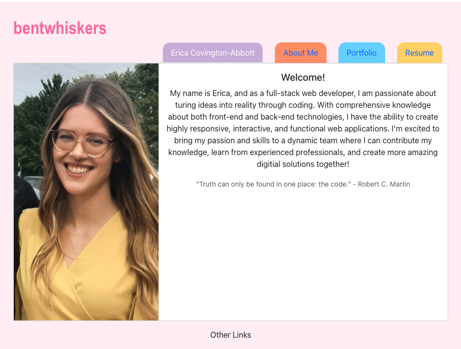

# My Portfolio

## Description
This is a portfolio website for my (Erica Covington-Abbott) works. These works showcase my skills as a developer, and will show future employers a glimpse of what I am capable of. This portfolio was built with React, and is deployed to Netlify. 

## Table of Contents
1. [Description](#description)
2. [Usage](#usage)
3. [License](#license)
4. [Questions](#questions)

## Usage

Netlify link:
    > https://bentwhiskers-portfolio.netlify.app/

## License
MIT License - see https://opensource.org/licenses/ to get more information about this license.

## Questions
Find me at (https://github.com/bentwhiskers) on GitHub.
Email me at abbott1414@gmail.com for further questions.
